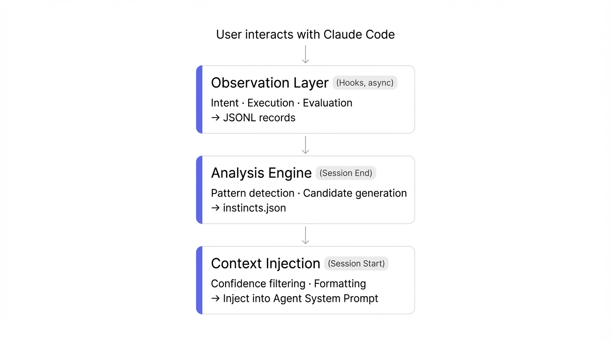

<p align="center">
  
</p>

# AgentMind — Self-Learning Memory System for AI Agents

> **Give your AI Agent memory, let it grow, and make it understand you better over time.**

[中文文档](./README.zh-CN.md)

AgentMind is a Claude Code Plugin that observes user-agent interactions, automatically learns coding preferences, workflow patterns, and best practices, then intelligently applies them in future sessions.

## Core Philosophy

```
Observe → Understand → Memorize → Apply → Validate → Evolve
   O          U           M         A         V         E
```

## Installation

### Option 1: Marketplace (Recommended)

```bash
# Run in Claude Code
/plugin marketplace add agentmind/agentmind-plugin
/plugin install agentmind@agentmind-marketplace
```

### Option 2: Local Development

```bash
# Clone the project
git clone https://github.com/Youhai020616/Agentmind.git
cd Agentmind

# Install dependencies
npm install

# Load in development mode
claude --plugin-dir .
```

## Features

### Automatic Learning (Zero Configuration)

AgentMind runs automatically in the background after installation:

- **Intent Observation** — Detects user corrections and preference expressions
- **Execution Observation** — Records tool call patterns (no code content stored)
- **Evaluation Observation** — Tracks error patterns and resolutions
- **Context Injection** — Automatically loads learned preferences at each session start

### Commands

| Command | Description |
|---------|-------------|
| `/agentmind:status` | View learning status overview |
| `/agentmind:instincts` | Browse and manage learned instincts |
| `/agentmind:reflect` | Review pending learning outcomes |
| `/agentmind:evolve` | Analyze and execute instinct evolution |
| `/agentmind:dashboard` | Visualize learning data |

### Confidence System

AgentMind uses a three-dimensional composite confidence score:

```
Composite Confidence = Frequency × 0.35 + Effectiveness × 0.40 + Human × 0.25
```

| Confidence | Level | Behavior |
|------------|-------|----------|
| ≥ 0.8 | Core | Auto-injected into agent context |
| 0.6–0.8 | Strong | Auto-suggested when contextually relevant |
| 0.4–0.6 | Moderate | Provided only when asked |
| 0.2–0.4 | Tentative | Silent observation, not applied |
| < 0.2 | Deprecated | Marked for deletion |

### Four-Level Evolution

```
Level 0: Instinct    — Single trigger → Single action
Level 1: Pattern     — Multi-step ordered sequence
Level 2: Strategy    — Transferable decision principles
Level 3: Expert      — Complete domain capability set
```

## Development

### Prerequisites

- Node.js 20+
- Claude Code (latest)
- jq (shell script dependency)

### Local Development

```bash
# Install dependencies
npm install

# Grant execute permissions to scripts
chmod +x scripts/*.sh

# Start Claude Code in development mode
claude --plugin-dir .

# Debug mode (view Hook output)
claude --plugin-dir . --debug
```

### Run Tests

```bash
npm test
```

### Build

```bash
npm run build
```

### Lint

```bash
npm run lint
```

## Architecture

<p align="center">
  
</p>

### Data Flow

<p align="center">
  
</p>

### Hook Mapping

| Event | Script | Mode | Purpose |
|-------|--------|------|---------|
| SessionStart | inject-context.sh | Sync | Inject learning context |
| UserPromptSubmit | observe-intent.sh | Async | Intent layer observation |
| PreToolUse | observe-execution.sh | Async | Execution observation (pre) |
| PostToolUse | observe-execution.sh | Async | Execution observation (post) |
| PostToolUseFailure | observe-evaluation.sh | Async | Error pattern collection |
| Stop | analyze-session.sh | Async | Session analysis |
| PreCompact | pre-compact-save.sh | Sync | Save critical data |
| SessionEnd | analyze-session.sh | Sync | Final persistence |

## Privacy

AgentMind only stores **behavioral patterns**, never code content:

- Tool call sequences (e.g., `Grep → Read → Edit`)
- File extensions (`.ts`, `.tsx`) instead of file paths
- Error types (`TypeError`) instead of error details
- User correction patterns instead of conversation transcripts

All data is stored locally in the `data/` directory by default.

## Roadmap

- [x] Phase 0: Plugin skeleton and core files
- [ ] Phase 0.5: Script debugging and local testing
- [ ] Phase 1: Analysis engine enhancement + Confidence system
- [ ] Phase 2: Evolution system + Dashboard
- [ ] Phase 3: Marketplace release
- [ ] Phase 4: SDK extraction + Cloud version

## License

MIT
