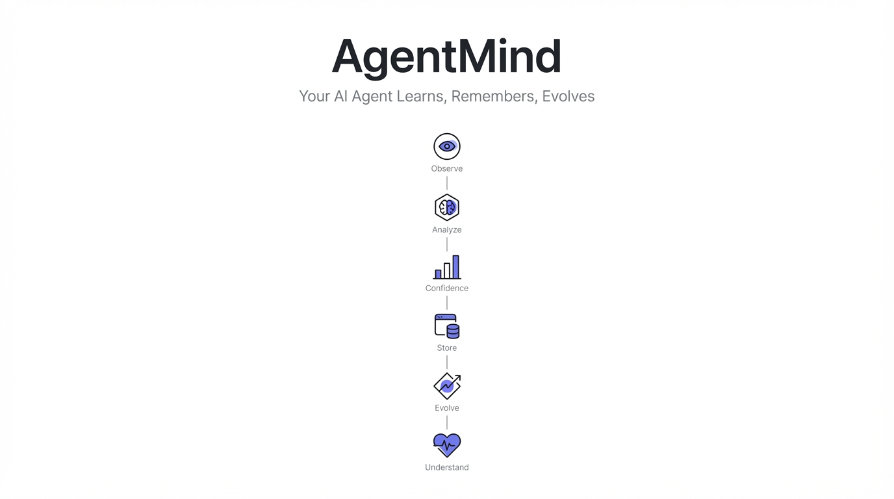
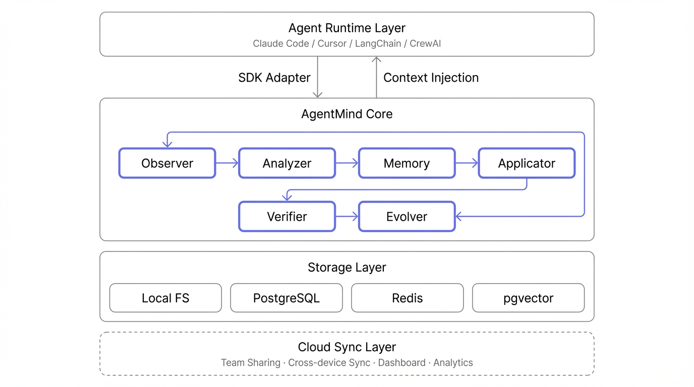

<p align="center">
  
</p>

<h1 align="center">AgentMind</h1>
<p align="center"><strong>Self-Learning Memory System for AI Agents</strong></p>
<p align="center">Give your AI agent memory. Let it learn your style. Make it better over time.</p>

<p align="center">
  <a href="https://github.com/Youhai020616/Agentmind/stargazers"></a>
  <a href="https://github.com/Youhai020616/Agentmind/fork"></a>
  <a href="./LICENSE"></a>
  
</p>

<p align="center">
  <a href="#quick-start">Quick Start</a> •
  <a href="#how-it-works">How It Works</a> •
  <a href="#features">Features</a> •
  <a href="#why-agentmind">Why AgentMind</a> •
  <a href="./README.zh-CN.md">中文文档</a>
</p>

---

## The Problem

Every time you start a new session with an AI coding agent, it forgets everything:

- ❌ Your coding style preferences
- ❌ The mistakes it already made (and you corrected)
- ❌ Your project conventions and patterns
- ❌ The workflows that work best for you

**You end up repeating the same corrections, over and over.**

## The Solution

AgentMind observes how you work, learns your preferences, and automatically applies them in future sessions. Zero configuration. Install and forget.

```
Session 1:  You correct the agent → AgentMind observes
Session 2:  Agent remembers → No correction needed
Session 10: Agent anticipates → Works exactly how you like
```

## Why AgentMind

| Approach | Remembers? | Learns? | Cross-Session? | Zero Config? |
|----------|:---:|:---:|:---:|:---:|
| AGENTS.md / CLAUDE.md | ✅ | ❌ Manual | ✅ | ❌ Manual |
| Chat history | ❌ Lost | ❌ | ❌ | ✅ |
| Custom system prompts | ✅ | ❌ Manual | ✅ | ❌ Manual |
| **AgentMind** | ✅ | ✅ Auto | ✅ | ✅ |

**AgentMind is the only solution that learns automatically from your behavior and applies it across sessions.**

## Quick Start

### Install (30 seconds)

```bash
# In Claude Code
/plugin marketplace add Youhai020616/Agentmind
/plugin install agentmind@agentmind-marketplace
```

That's it. AgentMind starts learning immediately.

### Or install from source

```bash
git clone https://github.com/Youhai020616/Agentmind.git
cd Agentmind && npm install
claude --plugin-dir .
```

## How It Works

```
          You work with your AI agent
                    │
         ┌──────────▼──────────┐
         │   👁️  OBSERVE        │  Watches corrections, patterns, errors
         └──────────┬──────────┘
                    │
         ┌──────────▼──────────┐
         │   🧠 UNDERSTAND     │  Extracts preferences and patterns
         └──────────┬──────────┘
                    │
         ┌──────────▼──────────┐
         │   💾 MEMORIZE       │  Stores as "instincts" with confidence
         └──────────┬──────────┘
                    │
         ┌──────────▼──────────┐
         │   ⚡ APPLY          │  Auto-injects into future sessions
         └──────────┬──────────┘
                    │
         ┌──────────▼──────────┐
         │   ✅ VALIDATE       │  Tracks if it helped or not
         └──────────┬──────────┘
                    │
         ┌──────────▼──────────┐
         │   🔄 EVOLVE         │  Strengthens good patterns, drops bad
         └──────────┴──────────┘
```

### Confidence System

Every learned pattern gets a confidence score:

```
Confidence = Frequency × 0.35 + Effectiveness × 0.40 + Human Feedback × 0.25
```

| Confidence | Level | What happens |
|:---:|------|------|
| ≥ 0.8 | 🟢 Core | Auto-applied every session |
| 0.6–0.8 | 🔵 Strong | Suggested when relevant |
| 0.4–0.6 | 🟡 Moderate | Available on request |
| 0.2–0.4 | ⚪ Tentative | Observing silently |
| < 0.2 | 🔴 Deprecated | Queued for removal |

### Four-Level Evolution

Patterns grow smarter over time:

```
Level 0: Instinct    →  "Use semicolons in TypeScript"
Level 1: Pattern     →  "Always run tests before committing"
Level 2: Strategy    →  "When refactoring, start with types"
Level 3: Expert      →  "Full-stack TypeScript project workflow"
```

## Features

### 🔍 Automatic Observation (Zero Config)

| Observer | What it watches |
|----------|----------------|
| **Intent** | When you correct the agent or express preferences |
| **Execution** | Tool call patterns and workflows |
| **Evaluation** | Error patterns and how they get resolved |
| **Context** | Project conventions and coding style |

### 🎮 Commands

| Command | Description |
|---------|-------------|
| `/agentmind:status` | Learning status overview |
| `/agentmind:instincts` | Browse and manage learned patterns |
| `/agentmind:reflect` | Review pending learning outcomes |
| `/agentmind:evolve` | Trigger pattern evolution |
| `/agentmind:dashboard` | Visualize learning data |

### 🔒 Privacy First

- All data stored **locally** (never sent to any server)
- Only metadata patterns stored (no actual code content)
- You control what's learned via commands
- Full transparency — inspect any stored instinct

## Architecture

<p align="center">
  
</p>

```
agentmind/
├── hooks/           # Event observers (intent, execution, evaluation)
├── agents/          # Evolution engine, learning analyst
├── commands/        # CLI commands (status, instincts, reflect, evolve)
├── scripts/lib/     # Core library
│   ├── storage.ts       # Local persistence
│   ├── confidence.ts    # Confidence scoring
│   ├── detector.ts      # Pattern detection
│   ├── evolution.ts     # Pattern evolution
│   └── types.ts         # Type definitions
└── scripts/         # Shell integration
```

## Use Cases

**For individual developers:**
- Agent remembers your code style across sessions
- Fewer repeated corrections = faster coding

**For teams:**
- Export team conventions as shareable instincts
- Onboard new team members with learned patterns

**For AI agent builders:**
- Plug-in memory layer for any agent
- Modular: use storage, confidence, or detection independently

## Development

```bash
# Prerequisites: Node.js 20+, Claude Code (latest)

git clone https://github.com/Youhai020616/Agentmind.git
cd Agentmind
npm install
npm test          # Run tests
npm run build     # Build
```

## Roadmap

- [x] Core learning engine
- [x] Confidence scoring system
- [x] Four-level evolution
- [x] Claude Code plugin integration
- [ ] VS Code extension
- [ ] Cross-device sync
- [ ] Team sharing
- [ ] Multi-agent support
- [ ] OpenAI / Cursor integration

## Contributing

Contributions welcome! Some areas where help is appreciated:

- **New observers** — Detect more types of user preferences
- **Evolution strategies** — Smarter pattern merging and promotion
- **Integrations** — VS Code, Cursor, OpenCode, other agents
- **Testing** — More edge cases and real-world scenarios

## Star History

<a href="https://star-history.com/#Youhai020616/Agentmind&Date">
  <picture>
    <source media="(prefers-color-scheme: dark)" srcset="https://api.star-history.com/svg?repos=Youhai020616/Agentmind&type=Date&theme=dark" />
    <source media="(prefers-color-scheme: light)" srcset="https://api.star-history.com/svg?repos=Youhai020616/Agentmind&type=Date" />
    
  </picture>
</a>

## 🔗 Ecosystem

| Project | Description |
|---------|-------------|
| [stealth-cli](https://github.com/Youhai020616/stealth-cli) | Anti-detection browser CLI powered by Camoufox |
| [stealth-x](https://github.com/Youhai020616/stealth-x) | Stealth X/Twitter automation |
| [dy-cli](https://github.com/Youhai020616/douyin) | Douyin/TikTok CLI |
| [xiaohongshu](https://github.com/Youhai020616/xiaohongshu) | Xiaohongshu automation |
| [freepost](https://github.com/Youhai020616/freepost-saas) | AI social media management |

## License

[MIT](./LICENSE)
