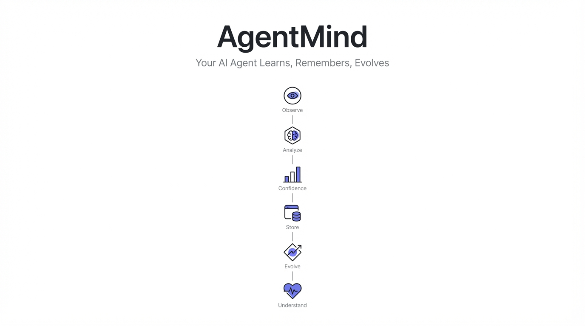
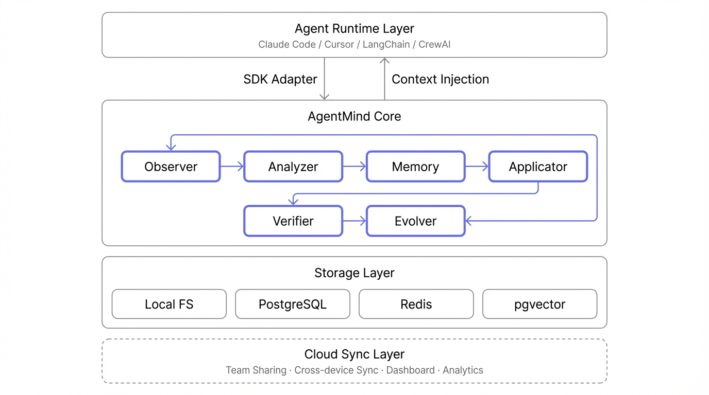

<p align="center">
  
</p>

# AgentMind — Agent 自学习记忆系统

> **让 AI Agent 拥有记忆、学会成长、越用越懂你。**

[English](./README.md)

AgentMind 是一个 Claude Code Plugin，通过观察用户与 AI Agent 的交互行为，自动学习编码偏好、工作流模式和最佳实践，并在后续会话中智能应用。

## 核心理念

```
观察 → 理解 → 记忆 → 应用 → 验证 → 进化
  O       U       M       A       V       E
```

## 安装

### 方式一：Marketplace（推荐）

```bash
# 在 Claude Code 中执行
/plugin marketplace add agentmind/agentmind-plugin
/plugin install agentmind@agentmind-marketplace
```

### 方式二：本地开发

```bash
# 克隆项目
git clone https://github.com/agentmind/agentmind-plugin.git
cd agentmind-plugin

# 安装依赖
npm install

# 以开发模式加载
claude --plugin-dir .
```

## 功能概览

### 自动学习（零配置）

安装后 AgentMind 自动在后台运行：

- **意图观察** — 检测用户纠正和偏好表达
- **执行观察** — 记录工具调用模式（不存储代码内容）
- **评估观察** — 追踪错误模式和解决方案
- **上下文注入** — 每次会话自动加载已学习的偏好

### 命令

| 命令 | 说明 |
|------|------|
| `/agentmind:status` | 查看学习状态总览 |
| `/agentmind:instincts` | 浏览和管理已学习的本能 |
| `/agentmind:reflect` | 审核待确认的学习成果 |
| `/agentmind:evolve` | 分析并执行本能进化 |
| `/agentmind:dashboard` | 可视化学习数据 |

### 置信度系统

AgentMind 使用三维复合置信度评分：

```
复合置信度 = 频率分 × 0.35 + 效果分 × 0.40 + 人工分 × 0.25
```

| 置信度 | 级别 | 行为 |
|--------|------|------|
| ≥ 0.8 | Core | 自动注入到 Agent 上下文 |
| 0.6-0.8 | Strong | 上下文相关时自动建议 |
| 0.4-0.6 | Moderate | 仅在被询问时提供 |
| 0.2-0.4 | Tentative | 静默观察，不应用 |
| < 0.2 | Deprecated | 标记删除 |

### 四级进化

```
Level 0: 原子本能 (Instinct)    — 单一触发 → 单一动作
Level 1: 行为模式 (Pattern)     — 多步骤有序序列
Level 2: 策略 (Strategy)        — 可迁移的决策原则
Level 3: 专家系统 (Expert)      — 完整领域能力集
```

## 项目结构

```
agentmind/
├── .claude-plugin/
│   ├── plugin.json              # 插件清单
│   └── marketplace.json         # Marketplace 定义
├── skills/                      # 自动激活的 Skills
│   ├── agentmind-context/       # 学习上下文注入
│   └── agentmind-guide/         # 行为指导
├── commands/                    # 用户命令
│   ├── status.md
│   ├── reflect.md
│   ├── evolve.md
│   ├── instincts.md
│   └── dashboard.md
├── agents/                      # 专用 Agents
│   ├── learning-analyst.md
│   └── evolution-engine.md
├── hooks/
│   └── hooks.json               # 事件钩子注册
├── scripts/                     # Hook 脚本
│   ├── observe-intent.sh
│   ├── observe-execution.sh
│   ├── observe-evaluation.sh
│   ├── inject-context.sh
│   ├── analyze-session.sh
│   ├── pre-compact-save.sh
│   └── lib/                     # 核心 TypeScript 库
│       ├── types.ts
│       ├── storage.ts
│       ├── detector.ts
│       ├── confidence.ts
│       ├── instinct-manager.ts
│       ├── context-generator.ts
│       └── run.sh
├── data/                        # 运行时数据 (.gitignore)
├── docs/                        # 设计文档
│   ├── 00-README.md
│   ├── 01-system-architecture.md
│   ├── 02-observation-layer.md
│   ├── 03-analysis-engine.md
│   ├── 04-confidence-system.md
│   ├── 05-evolution-system.md
│   ├── 06-api-sdk-design.md
│   ├── 07-commercialization.md
│   ├── 08-implementation-roadmap.md
│   ├── 09-market-analysis.md
│   └── 10-claude-code-plugin-guide.md
├── package.json
├── tsconfig.json
└── README.md                    # 本文件
```

## 开发

### 前置要求

- Node.js 20+
- Claude Code (最新版)
- jq (shell 脚本依赖)

### 本地开发

```bash
# 安装依赖
npm install

# 给脚本添加执行权限
chmod +x scripts/*.sh

# 以开发模式启动 Claude Code
claude --plugin-dir .

# 调试模式（查看 Hook 输出）
claude --plugin-dir . --debug
```

### 运行测试

```bash
npm test
```

### 构建

```bash
npm run build
```

### 代码检查

```bash
npm run lint
```

## 架构

<p align="center">
  
</p>

### 数据流

```
用户与 Claude Code 交互
        │
        ▼
┌─────────────────────────────────┐
│  四层观察 (Hooks, async)         │
│  意图 · 执行 · 评估              │
│  → JSONL 记录                    │
└──────────────┬──────────────────┘
               │
               ▼
┌─────────────────────────────────┐
│  分析引擎 (Session End)          │
│  模式检测 · 候选生成              │
│  → 更新 instincts.json           │
└──────────────┬──────────────────┘
               │
               ▼
┌─────────────────────────────────┐
│  上下文注入 (Session Start)      │
│  置信度过滤 · 格式化              │
│  → 注入 Agent System Prompt      │
└─────────────────────────────────┘
```

### Hook 映射

| 事件 | 脚本 | 模式 | 用途 |
|------|------|------|------|
| SessionStart | inject-context.sh | 同步 | 注入学习上下文 |
| UserPromptSubmit | observe-intent.sh | 异步 | 意图层观察 |
| PreToolUse | observe-execution.sh | 异步 | 执行层观察（pre） |
| PostToolUse | observe-execution.sh | 异步 | 执行层观察（post） |
| PostToolUseFailure | observe-evaluation.sh | 异步 | 错误模式收集 |
| Stop | analyze-session.sh | 异步 | 会话分析 |
| PreCompact | pre-compact-save.sh | 同步 | 保存关键数据 |
| SessionEnd | analyze-session.sh | 同步 | 最终持久化 |

## 隐私

AgentMind 只存储**行为模式**，不存储代码内容：

- 工具调用序列（如 `Grep → Read → Edit`）
- 文件扩展名（`.ts`, `.tsx`）而非文件路径
- 错误类型（`TypeError`）而非错误详情
- 用户纠正模式而非对话原文

所有数据默认存储在本地 `data/` 目录。

## 设计文档

完整设计文档位于 `docs/` 目录：

| 文档 | 内容 |
|------|------|
| [00-README](docs/00-README.md) | 项目概述与文档索引 |
| [01-system-architecture](docs/01-system-architecture.md) | 六层系统架构设计 |
| [02-observation-layer](docs/02-observation-layer.md) | 四层观察系统 |
| [03-analysis-engine](docs/03-analysis-engine.md) | 分析引擎与因果推理 |
| [04-confidence-system](docs/04-confidence-system.md) | 三维复合置信度系统 |
| [05-evolution-system](docs/05-evolution-system.md) | 四级进化机制 |
| [06-api-sdk-design](docs/06-api-sdk-design.md) | API/SDK 接口设计 |
| [07-commercialization](docs/07-commercialization.md) | 商业化方案与定价 |
| [08-implementation-roadmap](docs/08-implementation-roadmap.md) | 分阶段实施路线图 |
| [09-market-analysis](docs/09-market-analysis.md) | 深度市场分析 |
| [10-claude-code-plugin-guide](docs/10-claude-code-plugin-guide.md) | Claude Code Plugin 开发规范 |

## 路线图

- [x] Phase 0: Plugin 骨架与核心文件
- [ ] Phase 0.5: 脚本调试与本地测试
- [ ] Phase 1: 分析引擎增强 + 置信度系统
- [ ] Phase 2: 进化系统 + Dashboard
- [ ] Phase 3: Marketplace 发布
- [ ] Phase 4: SDK 提炼 + Cloud 版本

## License

MIT
